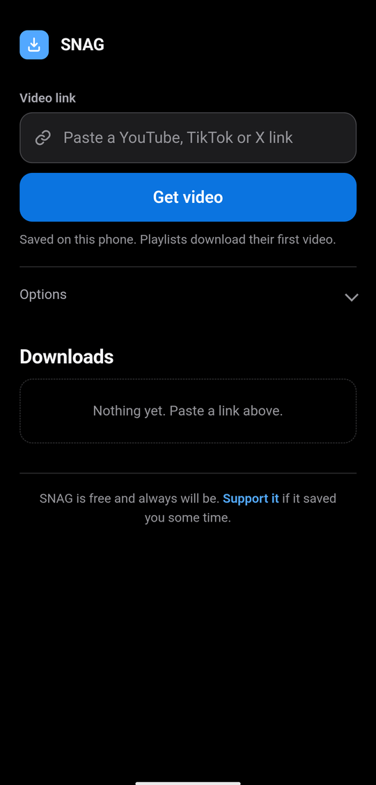
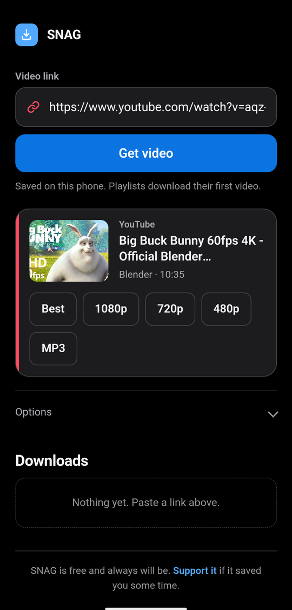
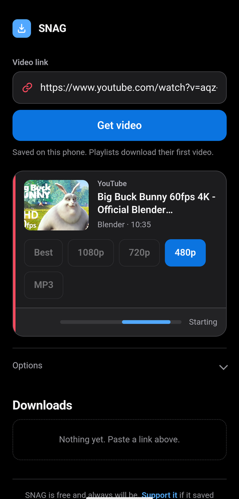
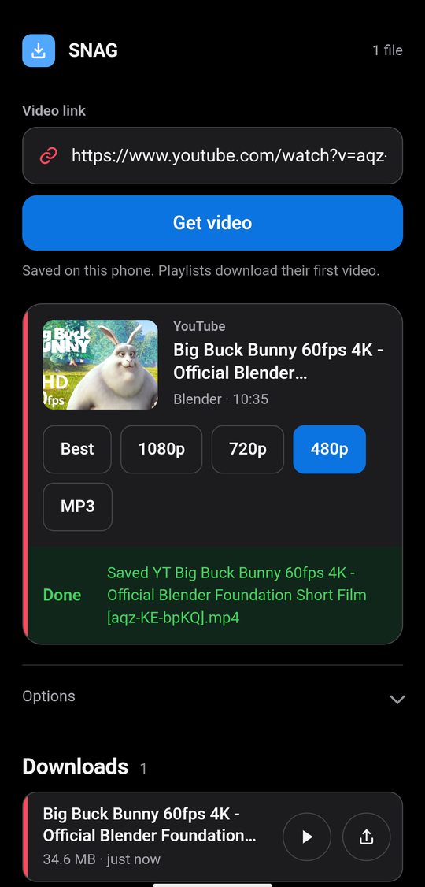

# SNAG

Save videos from YouTube, TikTok, X and around a thousand other sites straight to
your Android phone. No account, no ads, no server: the download happens on the
device and the file never leaves it.


SNAG bundles a real [yt-dlp](https://github.com/yt-dlp/yt-dlp) and a real
[FFmpeg](https://ffmpeg.org) inside the APK, driven by a small local web UI.
Because they are the genuine tools rather than a reimplementation, it handles HD
stream merging, MP3 extraction and every site yt-dlp supports.

| | | | |
| :---: | :---: | :---: | :---: |
|  |  |  |  |
| Paste a link | Pick a quality | Download | Saved on the phone |

## Install

Download the APK from [Releases](https://github.com/tnjappsss/SNAG/releases) and
open it on your phone. Android will ask you to allow installs from this source.

To check a download is genuine:

```bash
apksigner verify --print-certs app-release.apk
```

```
Signer #1 certificate SHA-256: 2039afdc2d7f034f90e948aa76bd50988dccd618cf31d1200692961c82258d11
```

**Requirements:** Android 7.0 (API 24) or later, **arm64-v8a** only. That covers
essentially every phone sold in the last decade, but excludes 32-bit devices,
emulators and ChromeOS.

### Not on Google Play

It cannot be. YouTube's Developer Policies forbid apps that let people download
videos for offline play outside YouTube Premium, and Google Play separately bars
apps that induce copyright infringement. Every yt-dlp based Android app is
distributed outside Play for the same reason.

## Using it

Paste a link and pick a quality, or share a link to SNAG directly from YouTube,
TikTok or X and the download starts on its own.

Files land in `Android/data/com.snag.app/files/SNAG/`. Android 11 and later hide
that folder from the Files app, so use the **⇪** button beside each download to
send a video to your gallery or another app. That goes through a `FileProvider`
declared in `res/xml/file_paths.xml`.

Keep SNAG on screen while a download runs. Android cuts network access to
backgrounded apps, which surfaces as `Failed to resolve` DNS errors from yt-dlp.
The app holds the screen awake to reduce the chance of that.

Cookies from a logged-in browser are not reachable from inside an APK, so private
or age-restricted videos need a `cookies.txt` file, which you can point at under
Options.


## Licence

GNU General Public License v3.0, see [LICENSE](LICENSE), with an additional
permission allowing the proprietary Google ad SDKs to be linked in
([LICENSE-EXCEPTION.md](docs/LICENSE-EXCEPTION.md)). The bundled FFmpeg is itself
GPLv3, and [THIRD_PARTY.md](docs/THIRD_PARTY.md) covers every third-party component
and its licence.
